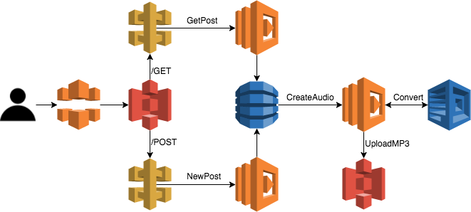

# AWS Serverless ve NLP Bölüm 1 - Lambda ve Polly ile Text-to-Speech

## Giriş
3 bölüm olacak AWS ile NLP çözümleri serimizin birincisinde Amazon'un [Polly](https://aws.amazon.com/polly/), [Lambda](https://aws.amazon.com/lambda/), [API Gateway](https://aws.amazon.com/api-gateway/), [S3](https://aws.amazon.com/s3/) ve [DynamoDB](https://aws.amazon.com/dynamodb/) araçlarını ve javascript esnext yazılım dilini kullanarak hiç bir sunucu kurulumu gerektirmeden tamamen asenkron çalışan bir web uygulaması hazırlayacağız.

Bu yazımızda sizlere AWS üzerinde sunucusuz olarak çalışabilen bir "Text-to-Speech" uygulama hazırlayacağız. Static bir web sayfası üzerinden aldığı metni Lambda yardımı ile DynamoDB veritabanına kaydedecek. Daha sonra DynamoDB'nın stream özelliği sayesinde asenkron olarak çalışan başka bir Lambda servisi ile belirtilen dil ve okuması istenen kişiye göre Polly servisine yollayıp bir s3 bucket'ına mp3 formatında kaydedecek. Daha sonra bu kaydettiğimiz ses dosyalarına yine aynı web uygulaması üzerinden erişmeyi sağlayacağız.

Servislerin ve uygulamanın deployment süreçlerini de yine "[Infrastructure as Code](https://en.wikipedia.org/wiki/Infrastructure_as_Code)" prensiplerine bağlı kalarak script'ler ile hazırlayacağız. Burada da yardımımıza [Amazon CloudFormation](https://aws.amazon.com/cloudformation/)  ve [Serverless Framework](https://serverless.com/) koşacak.

Yazının detaylarına inmeden çalışan uygulamayı görmek isterseniz yapmanız gereken şey oldukça basit:

1. AWS hesabı
2. Node.js v8.11.1 
3. Serverless Framework `npm install serverless -g`
4. Gereksinimler kurulduktan sonra repo'yu clone'ladığınız klasörde:

```
npm install
serverless deploy
```

!!ÖRNEK GİF GELSİN!! 

## Servis Diagramı
Kullanacağımız servislerin tümü AWS tarafından sağlanan serverless çözümlerdir. Bu çözümlerin hazırlayacağımız uyglamada nasıl yer alacağına karar vermekse bize kalıyor. Uygulamanın örnek servis diagramını aşağıda görebilirsiniz:



### CloudFront
Cloudfront Amazon'un CDN cözümü. Bu servisi static web uygulamalarını kıtalar arası hızlı bir şekilde host edebilmek için kullanıyoruz. Gerekli metni Polly'ye göndermek ve Polly'den mp3'e çevrilmiş dosyaları dinlemek için bu servisi kullanıyoruz. Detaylarına bu yazımızda değinmeyeceğiz.

### S3 (Simple Storage Service)
Hem static web uygulamasını hem de Polly ile seslendirilmiş mp3 dosyalarını tutmak için S3 kullanacağız. S3 servisinin bize avantajı hem oldukça ucuz olması hem de cloudfront ile entegrasyonu sayesinde kıtalar arası veri iletişimini oldukça kolay yapıyor olması. Ayrıca ekstra bir sunucu maliyeti getirmeden static web uygulamalarını host ediyor olması ve uptime'ının %99.99 seviyelerinde olması en büyük artıları.

### Api Gateway
Amazon Api Gateway, Amazon'un servislerinin veya sunucularının HTTP üzerinden haberleşmesini sağlayan çözümü. Klasik Api Gateway'lerden (Zuul, Spring Rest Controller, vs.) en büyük farkı herhangi bir sunucu gerektirmediği için kolaylıkla ayağa kaldırıp istediğiniz sistemleri dış dünyaya açabilmeniz.

Polly web uygulaması, Api Gateway'inde iki tane endpoint barındıracak. Birinci endpoint static web sayfasına daha önceden hazırlanmış Polly kayıtlarını gösteren `GET /GetPost`. İkincisi de yeni eklenmesini istediğimiz metinleri yükleyeceğimiz `POST /NewPost`. Api Gateway, bu iki endpoint'ten alınan istekleri işlenebilmesi için Lambda fonksiyonlarına iletecek.

### Lambda
Uygulamamızın en önemli iki servisinden ilki. Lambda Amazon'un FaaS (Function as a Service) çözümü. Herhangi bir sunucuya ihtiyaç duymadan, kendi çoklayabilen, event-driven uygulamalar yazılmasına olanak sağlayan bir servis. Şu an Node.js (JavaScript), Python, Java (Java 8 destekliyor), C# (.NET Core) ve Go dilleri ile uygulamalar yazmayı destekliyor.

Polly uygulamasında, TypeScript dili ile yazılmış 3 tane Lambda fonksiyonunu kullanacağız.

**1. GetPost Lambda:** Önceden işlenmiş olan kayıtları DynamoDB'den çekerek web sayfası üzerinde gösterimini sağlar.
**2. NewPost Lambda:** Yeni bir metin bilgisi alarak işlenmesi için DynamoDB veritabanına kaydeder.
**3. ConvertAudio Lambda:** DynamoDB'ye eklenen yeni metni Polly ile haberleşerek MP3'e çevirir ve S3'e kaydeder.

### DynamoDB
Yine serverless altyapısında barınan bir başka servis olan DynamoDB Amazon'un NoSQL çözümü. Aynı Lambda gibi auto-scale özelliği sayesinde gelen yüke göre donanım ihtiyaçlarını arka planda yükseltip alçaltabilen bir veritabanı olması en büyük avantajlarından. Ayrıca Lambda fonksiyonları ile çok iyi bir ikili olusturuyorlar. Bu konudaki en önemli özelliği ise veritabanında olan her olayı (event) bir stream üzerinden istenilen Lambda fonksiyonuna aktarabiliyor olması.

#### DynamoDB Streams
DynamoDB, normal bir NoSQL veritabanı olması yanında Amazon'un diğer servisleri ile haberleşebilmesi için alt özelliklere de sahip. Stream özelliği bunun en güzel örneklerinden. DynamoDB streams sayesinde tablolarda yapılan her değişiklik (ekleme, silme veya düzenleme) bir message stream'e daha sonra işlenmek üzere iletilebilir. Daha sonra bu stream'leri ister kendi sunucularınız üzerinden isterseniz de Lambda gibi çözümlere ileterek kullanabilirsiniz.

Polly uygulamasında yeni eklenen her metin bu stream özelliği ile Polly'ye iletilmek üzere bir Lambda fonksiyonuna iletilir. Bu sayede hem uyglama asenkron bir yapıda olur hem de istenildiği kadar Lambda fonksiyonu tetiklenebildiği için daha hızlı olur.

### Polly
Polly uygulamamızın en önemli servisi. Amazon'un istenilen metinlerin sesleştirilmesini sağlamak için sunduğu, yine serverless ekosisteminde bulunan çözümü. Polly kullanıcı açısından oldukça basit bir arayüz sunuyor.

1. Metni gir
2. Kimden duymak istediğini seç (Bir çok dil için birden fazla ses sanatçısı bulunuyor)
3. Seslendirilmiş metni AudioStream olarak geri al

Hal böyle olunca Polly uygulamasında, basit bir Lambda fonksiyonu ile istediğimiz metni istediğimiz formatta ses verisine dönüştürebiliyoruz.

## Uygulama
### Node.js ve Typescript
Bu yazı yazıldığı zaman AWS Lambda Node.js için v8.11.1 versiyonunu destekliyordu. Bu sebeple TypeScript ile geliştirdiğimiz uygulamayı Node.js v8.11.1'e göre derlememiz gerektiğine dikkat etmemiz gerekiyor. TypeScript compiler'ı bize bu konuda oldukça yardımcı oluyor. Eğer derlemeyi yaptığınız node sürümü v8.11.1 ise TypeScript otomatik olarak bu versiyona göre kendisini derliyor.

#### Neden TypeScript?
TypeScript, javascript dünyasında eksik olarak görülen bir çok özelliği içinde barındırıyor. Opsiyonel olarak değişken tiplerinin belirtilebiliyor olması, inheritance ve class yapılarının düzgün olması static typed dillerden gelen (java, c#, vs) bir çok yazılımcı için büyük bir nimet.

Typescript ile node.js uygulaması geliştirirken dikkat etmemiz gereken en önemli nokta TypeScript'in nasıl derlenmesi gerektiğini belirten `tsconfig.json` dosyası.

Polly `tsconfig.json`

```
{
  "compilerOptions": {
    "baseUrl": ".",
    "sourceMap": true,
    "lib": [
      "esnext"
    ],
    "noImplicitReturns": true,
    "noFallthroughCasesInSwitch": true,
    "paths": {
        "*": ["src/*"]
    },
    "outDir": ".build/"
  },
  "include": [
      "./src/**/*"
  ]
}
```

Burada TypeScript compiler'ına `esnext` özelliklerinin tamamını kullanmasına izin verdiğimizi, `src` klasöründe kaynak dosyalarının olacağını ve derlenmiş dosyaları `.build` klasörü altına atmasını söylüyoruz.
 
#### AWS Node.js SDK
Node.js ile Amazon servislerini kullanmak için Amazon'un Node.js SDK'sı bize oldukça büyük kolaylık sağlıyor. Amazon'un sunduğu tüm servisler için hem Javascript hem de Typescript için kullanılan bu sdk sayesinde Amazon servisleri ile rahat bir şekilde haberleşebiliyoruz. Bir kaç örnek vermek gerekirse;

DynamoDB'den kayıtları okumak için:

```
```

Polly ile metni ses verisine dönüştürmek için:

```
```

Oluşturulan ses verisini S3'e mp3 formatında yüklemek içinse:

```
```
#### Yazılım Mimarisi


### Serverless Framework
#### CloudFormation